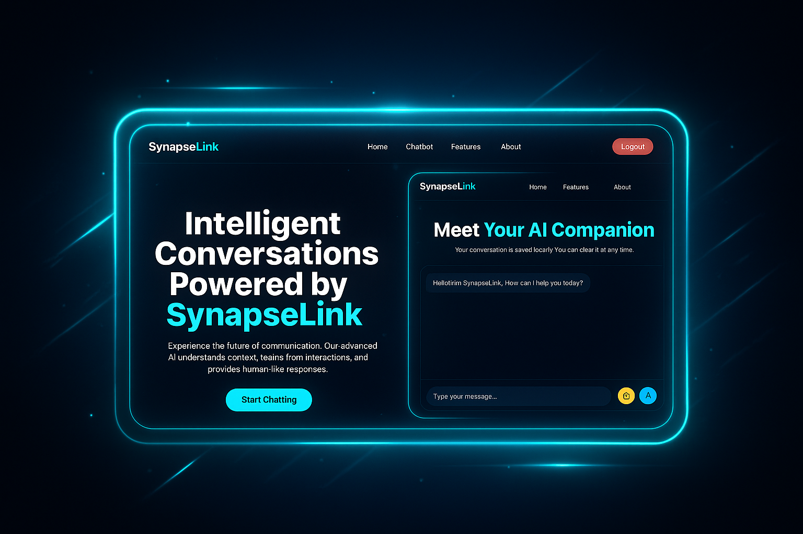

# 🔗 SynapseLink - AI Conversation Partner



A stunning, futuristic AI chatbot built with a glassmorphic design and powered by Google's Gemini API. Secure, responsive, and animated for a premium user experience.

[](https://synapse-link-ai-chatbot.vercel.app/)

---

## ✨ Core Features

| Feature                  | Description                                                                        |
| ------------------------ | ---------------------------------------------------------------------------------- |
| 🎨 **Elegant UI/UX** | A beautiful glassmorphic design with a tech-forward neon cyan and deep blue theme. |
| 🚀 **Dynamic Animations** | A custom preloader, animated content reveals, and interactive UI effects.          |
| 📱 **Fully Responsive** | Perfect viewing experience on all devices, from mobile to desktop.                 |
| 🔒 **Secure API** | API keys are kept secret on the backend using Vercel Serverless Functions.         |
| 💬 **Persistent Chat** | Chat history is saved to the user's local device for continuing conversations.     |
| 🔑 **User Authentication** | A simple, secure login system gates access to the chatbot.                         |

---

## 🛠️ Tech Stack

-   **Frontend:** `HTML5` `CSS3` `JavaScript (ES6+)` `Tailwind CSS`
-   **Backend:** `Vercel Serverless Functions (Node.js)`
-   **AI:** `Google Gemini API`
-   **Deployment:** `Vercel`

---

## 🚀 Quick Start & Local Setup

Get the project running on your local machine in a few simple steps.

1.  **Clone the Repository**
    ```bash
    git clone [https://github.com/your-username/your-repo-name.git](https://github.com/your-username/your-repo-name.git)
    cd your-repo-name
    ```

2.  **Install Vercel CLI**
    ```bash
    npm install -g vercel
    ```

3.  **Set Up Environment Variable**
    -   Create a file named `.env` in the root of your project.
    -   Add your Google API key to it:
      ```
      GOOGLE_API_KEY="YOUR_SECRET_GOOGLE_API_KEY_HERE"
      ```

4.  **Run the Development Server**
    ```bash
    vercel dev
    ```
    Your project will be live at `http://localhost:3000`.

---

## 🌐 Deploying to Vercel

Deploy your own version of SynapseLink with one click.

> **Important:**
> Before deploying, you must add your secret `GOOGLE_API_KEY` as an environment variable in your Vercel project settings.
>
> **Go to:** `Vercel Dashboard` -> `Your Project` -> `Settings` -> `Environment Variables`

[](https://synapse-link-ai-chatbot.vercel.app/)

---

## 🔑 Demo Credentials

-   **Username:** `demo`
-   **Password:** `password123`
